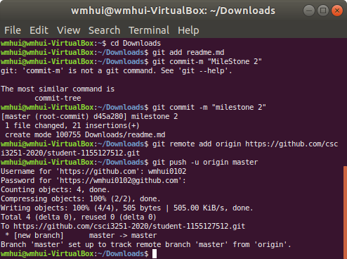

# CSCI3251 Project Milestone 2
## About me
Hello, I am Owen. I am a noob CS student and I am trying to make a markdown file

## Programming language that I learnt
- C
- Java

## Task list
- [x] hea
- [x] play guitar
- [ ] coding

## Some coding course
| Course Code | Course |
| --- | --- |
| ENGG1100 | C language |
| CSCI1130 | Java |
| CSCI2100 | Data Structure |

## Screenshot

